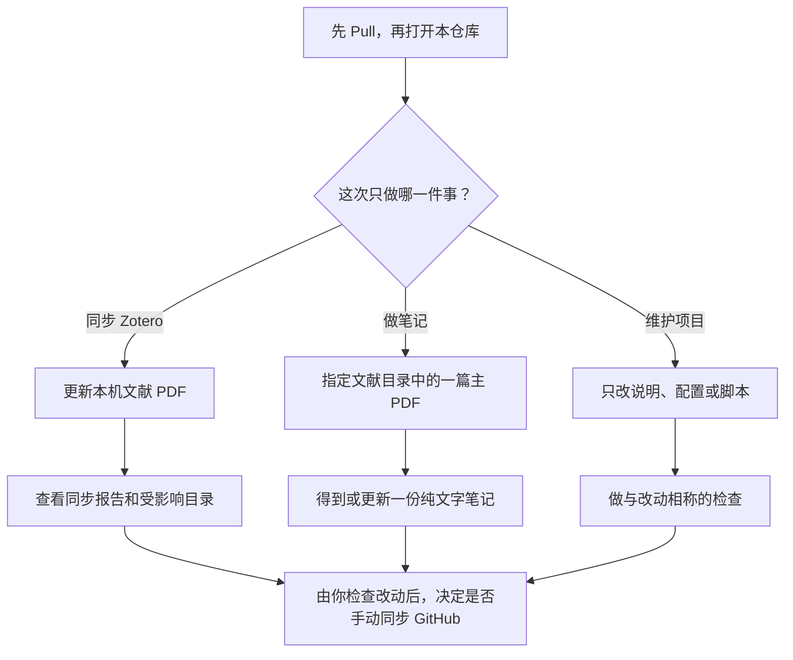
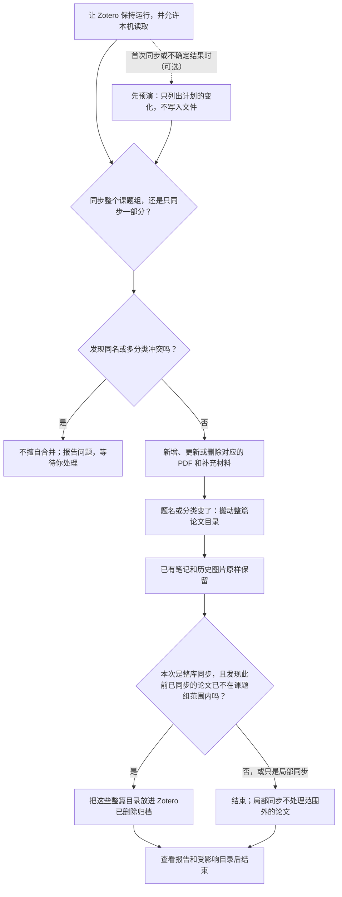
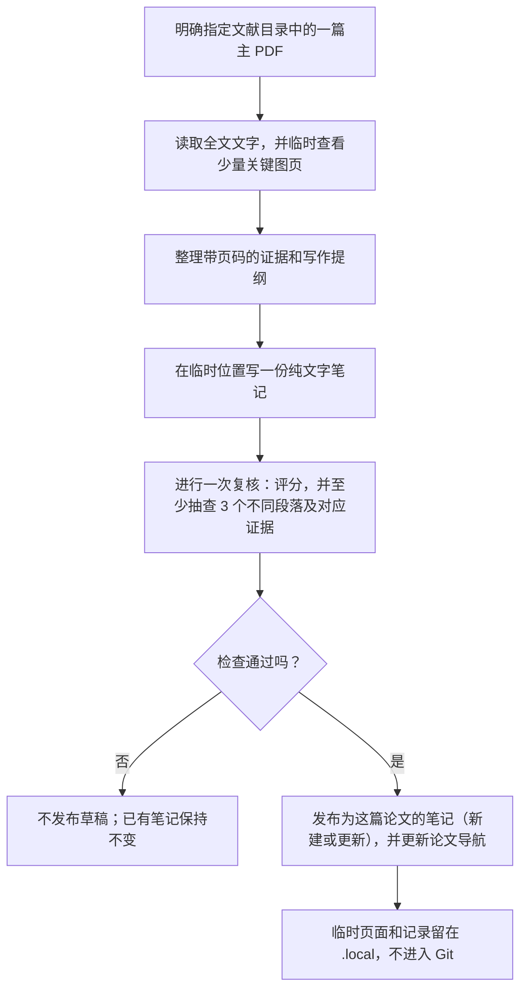
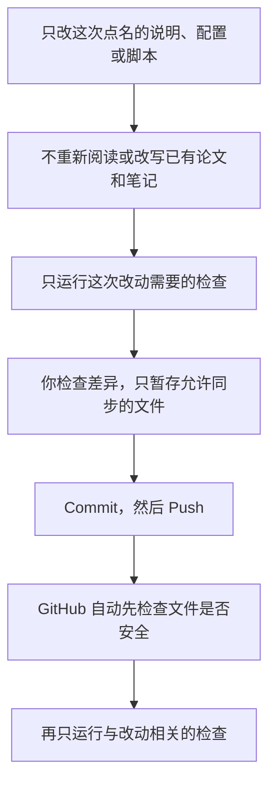

# Reference Management

这是一个用于论文精读的 Codex + Obsidian Vault。Zotero 是文献当前状态的本地镜像来源；DeepPaperNote 只使用 `文献/` 中已镜像的本地 PDF/SI 生成 Markdown 深读笔记。

## 日常使用

1. 在 Codex 侧边栏先 Pull，再用 Obsidian 打开本仓库根目录。
2. 明确选择一项任务：
   - **同步 Zotero**：要求使用 `zotero-pdf-sync` 手动镜像 `我的文库 / ZJU / 课题组`。
   - **做笔记**：明确指定 `文献/` 中一篇本地主文 PDF，要求生成或修改它的笔记。
   - **修改项目**：只维护说明、配置或脚本；已完成笔记默认不处理。

同步没有后台监听，只通过 Zotero Local API 只读访问本机附件，不读写 SQLite，也不需要云端 API key。它会按当前 Zotero 题名和分类移动整篇论文目录，保留其中的 PDF、笔记和图片而不重做笔记。整库同步发现某个已管理条目已不在根范围内时，会把整个目录归档到 `文献/Zotero已删除/`；归档不会进入导航、Base 或 Git，也不会被同步器自动恢复。

DeepPaperNote 没有联网输入：它只处理同一论文目录内的本地 PDF/SI，全文文字是笔记证据来源；少量关键页只在 `.local/deeppapernote/runs/<run_id>/` 中临时渲染供理解图形信息，不会作为图片发布。同步、迁移和项目维护都不会自动重新精读、复核或发布完成笔记。

## 文件布局

```text
文献/
├── 论文导航.md
├── 论文库.base
├── <分类>/<论文题名>/
│   ├── <主文或补充材料>.pdf
│   ├── 笔记.md       # 仅精读完成后存在；新笔记为纯文字
│   └── images/       # 旧笔记可保留的历史图片
└── Zotero已删除/     # 本地归档，不进入导航、Base 或 Git
```

直接位于 `课题组` 根分类的条目进入 `文献/未分类/<论文题名>/`。未精读论文仅保留同步后的 PDF；[论文导航](文献/论文导航.md) 与 [论文库](文献/论文库.base) 只展示正式论文树中的笔记。

## 运行环境

Windows 本地统一使用 Miniconda 环境 `deeppapernote`：

```powershell
conda create -n deeppapernote python=3.12 pip -y
conda run --no-capture-output -n deeppapernote python -m pip install ".agents/skills/DeepPaperNote[dev]"
conda env config vars set -n deeppapernote PYTHONUTF8=1 PYTHONIOENCODING=utf-8
```

后续命令均通过该环境顺序执行。详细操作见 `.agents/skills/zotero-pdf-sync/SKILL.md` 与 `.agents/skills/DeepPaperNote/SKILL.md`。

## GitHub 同步

1. Pull。
2. 让 Codex 修改并完成相应检查。
3. 检查改动，只暂存 `AGENTS.md` 允许同步的文件。
4. Commit。
5. Push。

Codex 不执行暂存、Commit 或 Push。PDF、归档树、本机状态、密钥、缓存和临时文件不得进入 Git。项目维护历史见 [更新报告](更新报告.md)。

## 工作流图（通俗版）

每次只选一种工作；同步文献、做笔记和维护项目不会自动串成下一步。

### 先选本次要做的事



### 1. 同步 Zotero



同步不会阅读论文内容、改写笔记、重建导航或自动开始做笔记。这里“此前已同步、现在不在范围内”指整个 `我的文库 / ZJU / 课题组` 查询不到的旧目录，例如该条目已从 Zotero 删除或移出这个范围；并不是说根分类本身会变。局部同步中，没有被选中的分类或论文一律不动。直接放在“课题组”根分类的论文会进入 `文献/未分类/`。

### 2. 为一篇论文做笔记



这一步只使用已经同步到本机的主文 PDF 和同目录补充材料，不联网查资料，也不读取 `Zotero已删除/` 归档。三处是最低的可追溯抽查记录，不是只复核三处：复核还要完成七项质量评分，且不能留下未解决问题。新笔记不发布图片；旧笔记已有的图片不会被自动删除。

### 3. 维护项目和同步 GitHub



PDF、`Zotero已删除/`、`.local/`、本机设置和密钥始终不应进入 Git；Codex 不会替你暂存、提交或推送。
